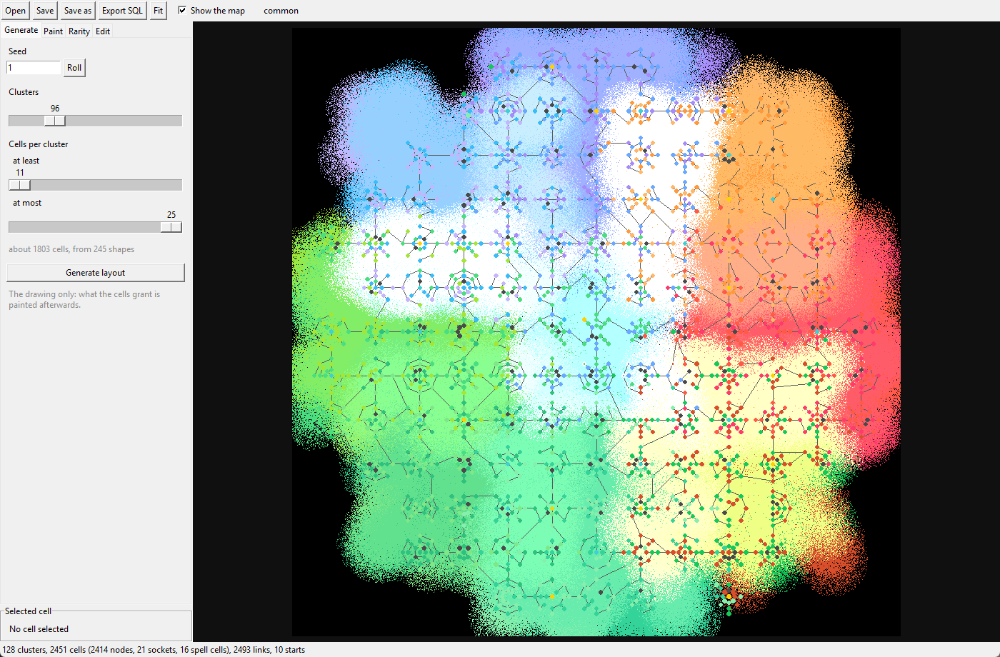
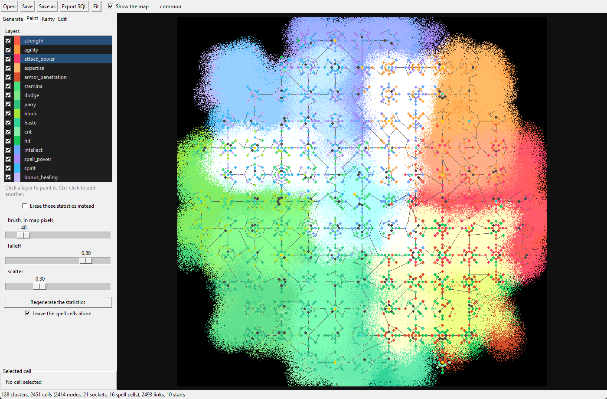
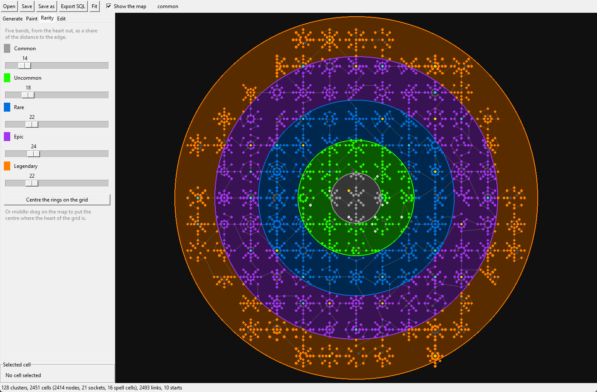
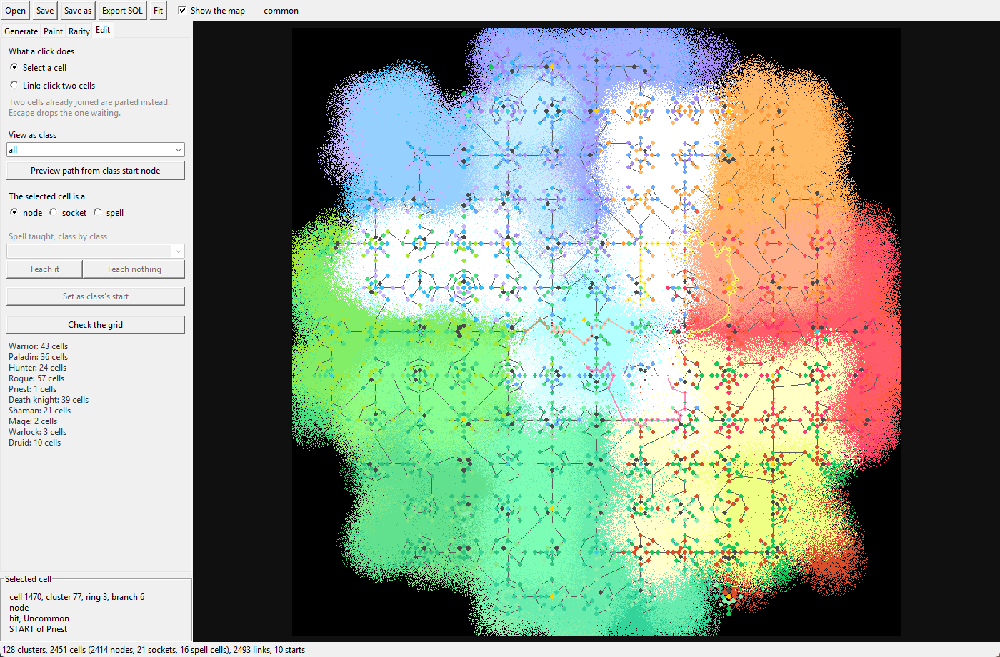
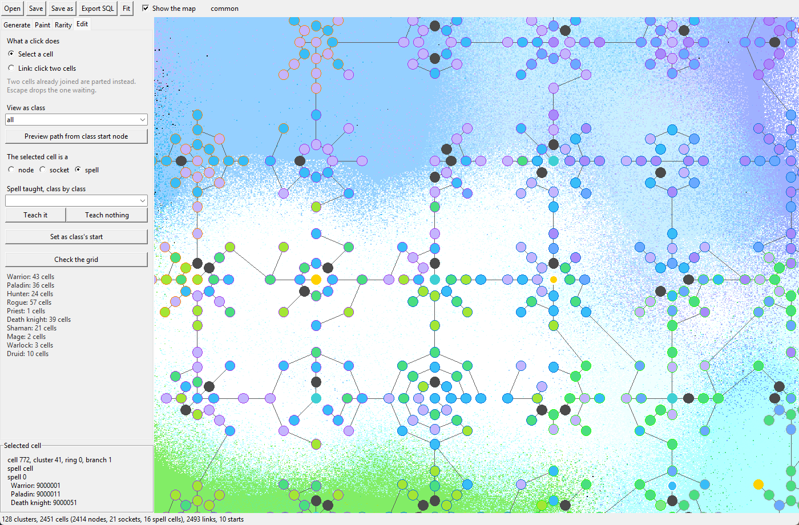

# How to

Each entry says what you want to do, what to do, and what tells you it worked.
Paths are relative to the module; commands typed in game start with a dot,
commands typed in the server's console do not.

Two words are worth learning first, because they are not the same thing:

* **`.spheregrid reload`** makes the module read the grid, the prices and the
  configuration again. Anything you change in the database or in the conf needs
  it.
* **`.reload ale`** reloads the Lua interface only. It changes what is drawn,
  never what the module believes.

---

## Put the module on a server

1. Clone the repository and copy `mod-spheregrid` beside the other modules, or
   clone it straight into `<core>/modules/mod-spheregrid`.
2. Run `install.bat` (Windows) or `install.sh` (elsewhere). It asks where the
   server is, where the core sources are, where a client is, where to keep the
   copies it takes, and what to do.
3. Start with **Look only**: it reads and writes nothing, and says whether this
   server has room for the module.
4. Then run it again and let it install.
5. **Rebuild the core** so the module is compiled in, and install
   [AIO](https://github.com/Rochet2/AIO) on the server and on the client.

It worked when the world starts without complaint and `.spheregrid info` in
game answers with the number of cells and links it has loaded.

## Patch a client that is not on the server

Most servers have no client on them. Patch the client where it lives:

```
python tools/install.py --client-only --client "<client>\Data"
```

That mode needs no server and touches no database: it merges the module's rows
into the client's own DBC files and writes them, with the module's art, into
`patch-Z.MPQ`.

It worked when the module's spells have a name and an icon in game instead of
a red question mark.

## Make room when the identifiers are taken

Another module may already use numbers this one wants. The survey says so, table
by table. Let the installer move them:

```
python tools/install.py --server <server> --core <core> --client <Data> --shift
```

It picks, for every family in clash, the smallest step that puts the whole
family on numbers nobody holds, and rewrites every file of the module — DBC
rows, SQL, C++ and Lua alike — **in the copy it lays under `modules/`**. The
checkout you installed from keeps the numbers it was written with.

It worked when the survey, run again, finds nothing taken.

## Draw a grid of my own

`layout.cmd` opens the layout editor. It works on the same XML the in-game
editor writes, in `<server>/lua_scripts/SphereGrid/editor/layouts`, so the two
can be used one after the other on the same grid.

### 1. The drawing



A seed, how many clusters, and how many cells a cluster may hold; the panel says
about how many cells that makes. **Generate layout** draws it: clusters taken
from the bank of shapes, joined until the whole thing is one island. Nothing is
decided yet about what the cells grant.

### 2. What the cells grant



One layer per statistic. Click a layer to paint it, Ctrl-click to add another —
several at once lay their bits on the same pixels — and close an eye to hide a
statistic and put it out of the brush's reach.

The brush softens the DENSITY, never the value: at a falloff of one the rim
becomes a stipple, which is the transition the reading pass wants. Black ground
means no preference, and the binding statistics land there.

**Regenerate the statistics** reads the map into the cells. It never touches a
link, and it leaves the spell cells alone unless you tell it otherwise.

### 3. How rare they are



The quality is not painted: it follows the distance to a centre, in five bands.
Move the centre with **Centre the rings on the grid**, which puts it at the
heart of the clusters, or by middle-dragging on the map. Then regenerate the
statistics again to lay the new qualities down.

### 4. The last hand



* **What a click does**: select a cell, or link two of them — clicking two cells
  already joined parts them instead.
* **View as class** governs everything under it. On `all`, **Preview path from
  class start node** draws the way in from every door at once, each class in its
  own colour, and the colours add up where two paths run together.
* **The selected cell is a** node, a rune socket or a spell cell.
* **Set as class's start** puts that class's door on the cell in hand.
* **Check the grid** says whether it is cut in two, whether links lie over one
  another, and offers to take you to the offending place. A class without a door
  is said in a banner that stays until you give it one.

### 5. Into the game

**Export SQL** writes `08_grid.sql` beside the layout and applies it to the
world database of the server the layout belongs to. Then, in game:

```
.spheregrid reload
```

To ship that grid with the module, copy the file over
`data/sql/world/08_grid.sql`.

## Change what a stone or a rune grants

Everything an operator tunes is in `mod-spheregrid.conf`, and nothing else:

```
SphereGrid.Stone.StatBonus.Common     = 5      … Legendary = 30
SphereGrid.NodeStone.StatBonus.Common = 1      what a pre-filled cell grants
SphereGrid.StatRune.Percent           = 10     of what the grid already gives
```

`.spheregrid reload` and it is done — no restart, no rebuild. The interface reads
the same file, so what it announces is what the module charges.

The text a stone shows in its tooltip is another matter: it lives in the spell
the item carries (`data/sql/world/05_spells.sql`), and changing it means
replaying that file and restarting the world.

## Change what a cell costs, and what content awards

```
SphereGrid.Cost.PerStep = 75      times its distance in links from the door
SphereGrid.Cost.Cap     = 2500    what a single cell may never exceed
SphereGrid.Points.Quest = 25
SphereGrid.Points.Level = 10
SphereGrid.Points.DungeonBoss.Wotlk = 125     … and so on, by tier
SphereGrid.Points.Grind.Rune = 750            what the workbench pays
```

`.spheregrid reload`. It worked when the window shows the new price on a cell
you have not bought.

## Put a spell on another cell

Open the layout, pick the cell, set it to **spell**, choose the class in **View
as class**, pick the spell in the list and press **Teach it**.



A spell is taught in ONE place: laid down a second time, it leaves the first —
the cell it stood on stays where it is and keeps everything else.

Then **Export SQL** and `.spheregrid reload`.

## Change where a class starts

Same window: pick the cell, choose the class, **Set as class's start**. The
banner at the bottom tells you which classes still have no door. Export, then
`.spheregrid reload`.

The distance from that door is what every cell of the grid costs, so moving a
door repricing the whole grid for that class is not a bug.

## Put a workbench in the world

The module ships the object, not a place for it: where it stands is a decision
about your world. The bench is shared with the other modules of the repository
that have recipes: one object, one window, each module's recipes on it. As a
game master, stand where you want one:

```
.gobject add 803700
```

As many as you like — a capital of each faction is the usual choice. The object
is a window, not a gate: `fuse`, `reroll`, `reforge` and `grind` are commands
too, so a player who never walks past one is not shut out.

## Change what drops, and how often

Every source is a setting, written as `object:quantity:percent`, `,` for a
fallback, `;` between independent rolls:

```
SphereGrid.Loot.WrathDungeonBoss = Luminous:2:20 ; RareStone:1:15
SphereGrid.Drop.Nexus.Luminous   = 100           a factor on top, in percent
```

A source that cannot be read is reported at start-up and falls back on the
built-in table. `.spheregrid reload` picks up a change.

## Add a language

Every message lives in `module_string`, and every language other than English
in `module_string_locale` (`data/sql/world/02_strings.sql`). Add your rows with
your locale, replay the file, restart the world.

The items and the spells carry their own texts: `item_template_locale` and the
`_Lang_*` columns of `spell_dbc`. Mind the trap the SQL warns about — the column
called `_Lang_koKR` is the one the client reads as French.

## Update the module

Run the installer on a server that already has it: it does not install, it
**removes**. Then run it again to install the new version.

```
python tools/install.py --server <server> --core <core> --client <Data> --keep-characters
python tools/install.py --server <server> --core <core> --client <Data> --shift
```

`--keep-characters` leaves the Spherite and the cells your players bought. The
spells the grid taught are taken back at the removal and taught again at the
next login, from the cells they still own.

## Take the module off

The same removal, with `--drop-characters` if you want what players earned gone
as well. It puts the client's own files back into `patch-Z`, deletes the module's
tables, its sources, its interface and its configuration, and leaves the
fifteen DBC files row-identical to what they were.

---

# When something is wrong

### The grid in game is not the one I drew

You exported and the window still shows the old grid, or a cell refuses to be
bought on a link you can see.

`.reload ale` reloads the interface, which reads the tables as it draws — so
the grid LOOKS new while the module still judges by the old one. Type
`.spheregrid reload`.

### `cell X is neither the start nor adjacent to an active cell`

The same thing, seen from the purchase: the module has not read your new links.
`.spheregrid reload`.

### The sphere grid window does not open

* AIO must be installed on the server AND in the client's `Interface\AddOns`.
  The installer's survey says whether it found the server half.
* The client keeps the addons it has been sent. After the module changes, type
  `/aio reset` in game: it clears that cache and reloads the interface.

### A Lua error whose line matches nothing

AIO obfuscates the code it sends, and says so itself: *error messages will not
have correct line numbers since obfuscation rearranges the code*. Variables are
renamed too, which is why an error may speak of a local called `o`.

While hunting a bug, in the server's `lua_scripts/AIO_Server/AIO.lua`:

```lua
local AIO_ENABLE_TRACEBACK = true
local AIO_CODE_OBFUSCATE = false
```

Then `.reload ale`, `/aio reset` in the client, and reproduce: the error will
name the real line. Put both settings back afterwards.

### The module's spells have no name, no icon, no effect

The client has not been patched. Its rows exist in no client until the installer
writes them: see [Patch a client](#patch-a-client-that-is-not-on-the-server).

### The workbench is nowhere in the world

The module ships the object and no spawn. Put one down with
`.gobject add 803700`.

### An item's tooltip has not changed

`item_template` is read when the world starts. Replay the SQL, then restart the
world; `.spheregrid reload` will not do it.

### The installer stops, saying identifiers are taken

Run it again with `--shift`. Without that word it refuses to move anything,
which is deliberate: moving a family rewrites every file of the module.

### The installer cannot find a worldserver.conf

It looks for `configs/worldserver.conf` under the folder you gave it. Give it
the folder that holds `worldserver.exe`, `configs` and `lua_scripts`.

### The layout editor says a class has no start

That banner stays until every class has a door. A grid can be exported without
one, and that class will have no way into the grid at all.

### The layout editor says links lie over one another

Three cells in a row joined all three ways, or a link drawn straight through a
cell it does not join. Press **Show the tangled links** to be taken to each in
turn, and unmake the one that is too long.

### The window and the game disagree about a layout

They share one file. If the game saves while the window is open, the window
reloads by itself — and asks first if there is unsaved work in it. When in
doubt, save on one side and reopen on the other.
